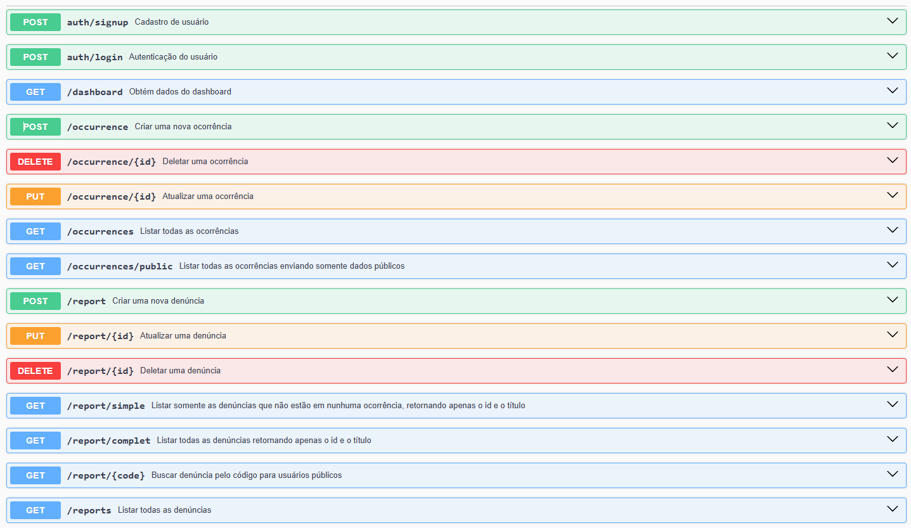

# SIG-SEG-API

## Autor

Luiz Gustavo da Silva

## Descrição

Projeto SIG-SEG (Sistema de Informação Gerencial para Secretaria de Segurança), feito para o cumprimento do desafio.

## Tecnologias

- Node.js
- TypeScript
- Express
- Zod-validation
- JWT-authentication
- bcrypt

## Como baixar e executar o projeto

### Pré-requisitos
Certifique-se de ter instalado em sua máquina:
- [Node.js](https://nodejs.org/)
- [Git](https://git-scm.com/)
- Um gerenciador de pacotes: `npm` (padrão) ou `yarn`

### Passos para rodar o projeto

1. **Clone o repositório**  

   git clone https://github.com/Luiz-gustavo-da-silva/SIG-SEG-API

2. **Acesse a pasta do projeto**

    cd sig-seg-api

3. **Instale as dependências**

    Se estiver usando npm:

    npm install

4. **Configure as variáveis de ambiente**

    Crie um arquivo .env na raiz do projeto e adicione as configurações necessárias, como credenciais do banco de dados e chave JWT.

    OBS.: Usei um banco de dados em nuvem.

5. **Execute o servidor**
    
    Para rodar em modo de desenvolvimento:

    npm run dev

6. **Acesse a API**

    O servidor estará rodando em:

    http://localhost:3000

## Rotas 

link da docs com o projeto local:  http://localhost:3000/api-docs/

# Vídeo com demonstração

https://drive.google.com/file/d/1E8YJd2j7ZT5mfNwFWAVWjOBa5qPKe8Z3/view?usp=sharing

# Link do front

https://github.com/Luiz-gustavo-da-silva/sigsegfront